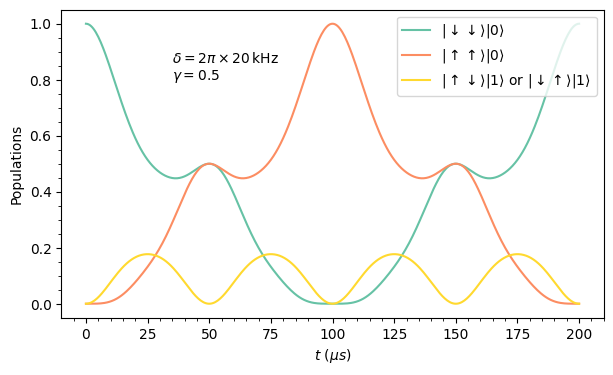
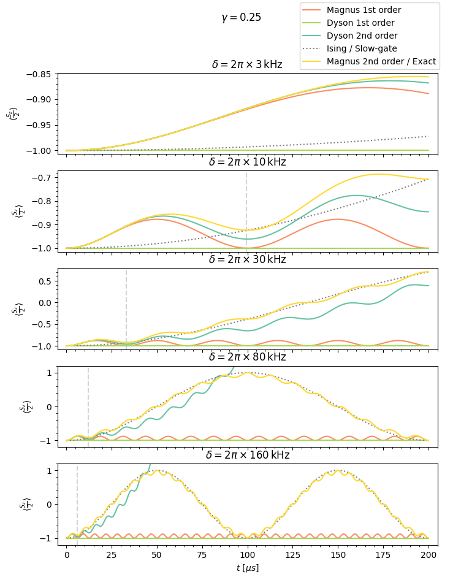

# perturbations

:warning: This repository is a work in progress in constant development! :hammer_and_wrench:

## About
Implementation of a Python simulation of a quantum system of 2 spins coupled to a phonon degree of freedom. The aim is to reproduce exactly the time evolution given by the Mølmer-Sørensen interaction, and then to test and apply different perturbative expansions such as the Magnus expansion, the Dyson series, the Schrieffer-Wolff transformation and the high frequency expansion.

The present work is done in collaboration with the [University of Trento](https://www.unitn.it/en) as part of my bachelor's thesis: "Perturbative expansions in quantum mechannics: overview, comparison and applications".

## How to run
The code is a simple Jupyter notebook running Python. All you need to do is to make sure you installed the Python libraries contained in the first block of code of the file `simulation.ipynb`. 

## Results
Here you can find an example of some results obtained with the code in `simulation.ipynb`:

     
&nbsp; &nbsp; &nbsp; &nbsp;
     
&nbsp; &nbsp; &nbsp; &nbsp;
     
&nbsp; &nbsp; &nbsp; &nbsp;
     
&nbsp; &nbsp; &nbsp; &nbsp;

## Acknowledgements
- [P. Hauke](https://hauke-group.physics.unitn.it/authors/hauke/) (professor and thesis advisor)
- [Diego Scantamburlo](https://github.com/diegoscantam)

## License
The code here presented is released under version 3 of the [GNU General Public License](https://www.gnu.org/licenses/gpl-3.0.html).
